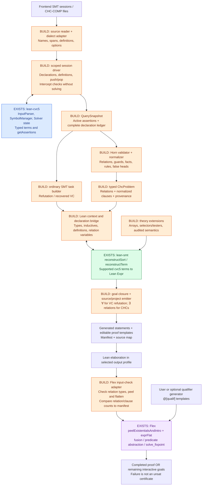

# SMT-LIB → Lean obligations and Flex: architecture and execution plan

Updated 2026-09-25. This is the architecture and evidence reference after inspecting
Flex and testing cvc5's CHC parser. [PR-PLAN.md](PR-PLAN.md) is the current ordered
execution plan, using the user's revised three stages.

## Decisions and goals

1. Use cvc5 as the parsing and sort-checking backend for standard CHC-COMP SMT-LIB.
   Do not require cvc5 to solve the problem. Its acceptance of `HORN` does not
   validate Horn structure; our importer performs that validation.
2. Share the source reader, scoped session model, typed terms, and theory mappings
   between ordinary SMT obligations and CHCs. They have different goal builders.
3. Export CHCs as `∃ relation interpretations, all clauses hold`, which is the
   positive existential problem Flex expects. Preserve this proposition for every
   recorded status, including unsat. A separate `¬ Problem` task may be offered for
   refutation, but it is not the normal input to Flex's invariant-synthesis path.
4. Generate Lean source as the interface to Flex. Do not serialize Lean `Expr`
   values across versions or require Flex and lean-smt to build in one Lake project.
5. Stage 1 covers complete pinned competition selections. The current `tests/`
   (12 files / 321 snapshots) are an early checkpoint. Flex compatibility belongs
   to Stage 3; frontend tooling belongs to Stage 2.
6. Keep translation, Lean elaboration, Flex input compatibility, and solver success
   as four distinct results. Proving all translated problems is not a release gate.
7. Preserve the long-term escape hatch: every supported query remains available as
   an editable Lean statement even when automated solving is incomplete.

## Evidence and pinned dependencies

| Component | Inspected version | Evidence and implication |
| --- | --- | --- |
| cvc5 executable | 1.3.2 | All four current CHC files pass unchanged with `--parse-only --type-checking`; no solving |
| lean-cvc5 | `7e3365990661b697ccb30e92d6912f4cc6589322` | Exposes parser, command, symbol-manager and assertion APIs; native dependency is cvc5 1.3.2 |
| lean-smt | `5bdc51674065a074ece67b04e10024e9f426ec1f` | Extensible sort/term reconstruction; Lean 4.33.0; main includes Mathlib, lean-auto, and lean-cvc5 |
| Public LeanHorn/Flex | `6bc56e2cecef1168c00345426b0ea278466d63c6` | Source inspected; Lean 4.29.0-rc8; Mathlib-free with pinned aesop |
| Local Flex | HEAD `8e22dfd823dcebca571d7f898180f5a477f910dc` plus pre-existing edits | Existing compiled cache used for a small Prop/peeling/flattening smoke test; not a clean build of the public pin |
| This translator | Lean 4.33.1 | Tasks 2.1–2.3 reconstruct and kernel-check a closed Boolean proposition; task 3.1 validates Boolean query inputs without solving |

The local Flex smoke test accepted a three-clause integer loop problem and found
one unary relation and three clauses. Nullary relations and a relation whose
argument types are `Prop` and `Int` were also recognized, including an inconsistent
nullary problem. No solver was
invoked in these interface tests. The public Flex revision still needs the same
test in a clean generated project before calling that integration verified.

The cvc5 CLI probe verifies syntax/sort compatibility, not our future API driver:
CLI parse-only mode skips executing assertions. The driver must invoke assertion
and scope commands explicitly and capture `getAssertions` at query boundaries.
The initial investigation only inspected the Lean FFI package. Task 2.1 subsequently
built the pinned bindings and reconstruction modules from source on Lean 4.33.1 and
launched the linked CLI. `lake exe testReconstruction` covers tasks 2.2–2.3: it
retrieves one assertion and verifies that only `set-logic` and `assert` were invoked.
The driver intercepts `check-sat`; `lake exe testParser` checks rejection of
unsupported or malformed input. Reconstruction translates the assertion with Lean-SMT
and installs `Reconstruction.assertion : Prop := True ∧ ¬False` in memory after a
synchronous kernel check and an axiom-dependency check. This smoke test also
passes after rebuilding all required Lean modules and the C++ binding from source,
reusing the pinned native cvc5 SDK. No solver query or proof reconstruction runs.
Mathlib's optional prebuilt-cache hook requires upstream's
exact Lean 4.33.0 and is skipped for this source build, as documented in README.

Task 3.1 extends the driver with Boolean declarations, supported metadata, and
`exit`. Its callback receives declaration names/native identities, assertions,
and an invocation trace only after the full input passes validation. The
`testParser` executable checks supported and rejected fixtures with input names
and command numbers in diagnostics.

Tasks 3.2–3.3 add `Smt2Lean/Translate.lean`: `withAssertions` creates fresh `Prop`
parameters, explicitly maps SMT names, and reconstructs assertions with fresh
Lean-SMT caches. `defineRefutation` builds `∀ parameters, (assertions) → False`,
using `True` for no assertions, and installs a kernel-checked, axiom-free
`Refutation : Prop` definition in memory. `testTranslation` checks names,
connectives, closure, and independence from status metadata.

Tasks 3.4–3.5 add `Smt2Lean/Emit.lean` and the CLI:
`smt2lean <input.smt2> --out <new-directory>`. The emitter uses Lean's printer for
one `Query.lean`: statements first, followed by proof templates with `sorry`, using
only Lean core. The file is written only after the full query is validated and its
statement is kernel-checked. Existing output paths are refused. Tests compare the
printed propositions with the originals and compile the file independently of
the translator. The reviewed demo walkthrough remains task 3.6.

For ordinary `tests/smt`, all eight unmodified files hit a cvc5 name collision at
the user-declared `set.card`. Diagnostic in-memory renaming plus `--force-logic=ALL`
lets seven parse; `lh_sets_neg` still fails on Z3's indexed array `map`. Input files
were not modified. These are concrete dialect-adapter requirements, not evidence
that the CHC files need rewriting.

## Architecture and ownership

Green is supplied by lean-smt; blue by lean-cvc5; purple by Flex; orange is our work.
Parser/reconstructor reuse does not provide the orange stages automatically.



Only CHC output follows the Flex path. The ordinary SMT path ends in independent
Lean obligations unless the user explicitly chooses another downstream tactic.

This diagram describes the target architecture. Implement the smallest runnable
path first: a Boolean query to Lean files, integer terms, then the first existing
CHC. Extend its source tracking, scopes, theory support, and packaging using actual
inputs. The manifest and benchmark automation follow working translation; the
diagram's eventual data contracts are not prerequisites for the first demo.

## Data contracts and modules to construct

The following are implementation contracts, not existing APIs. IDs carry binding
identity; raw spelling is only a display/source attribute.

```text
SourceReader / Dialect
  input: raw SMT-LIB bytes
  output: commands + spans + raw/binding-name map + semantic lowering registry

Session
  input: commands and typed cvc5 terms
  output at each check:
    QuerySnapshot {
      queryId, sourceSpan, sourceLogic, recordedStatus,
      visibleDeclarations, capturedDefinitions, datatypeDeclarations,
      activeAssertions, temporaryAssumptions, requiredFeatures
    }

Chc.Validate / Chc.Normalize
  input: QuerySnapshot
  output:
    ChcProblem { relations : Array RelationDecl, clauses : Array Clause,
                 backgroundSorts, requiredFeatures, provenance }
    RelationDecl { id, originalName, argumentSorts }  -- result is Bool
    Clause { universallyBoundVariables, orderedBody : Array Guard,
             head : RelationAtom | False, sourceSpan }
    Guard = TheoryFormulaWithoutUnknownRelations | RelationAtom
    RelationAtom { relationId, arguments : Array SortedTerm }

LeanBridge / Theory / Emit
  input: QuerySnapshot or ChcProblem
  output: closed, named Lean Prop definitions, dependencies, source map,
          and editable proof templates following the statements in the same file

FlexAdapter (in the output project, built with Flex's toolchain)
  input: a generated Prop declaration and expected relation/clause signature
  output: compatible | unsupported_shape | elaboration_error
```

Keep a source-owned definition ledger even with cvc5: symbol-manager declaration
lists do not preserve every definition body, datatype declaration, or source name.
Use fresh reconstruction context/caches per query; no cached free variable may
escape its local context. Reconstructors and the declaration bridge cooperate:
the bridge needs sort reconstruction, while term reconstruction needs `userNames`.

The ordinary dialect adapter alpha-renames user symbols by binding identity to
avoid builtin collisions. For the exact Z3 array-map operation required today, a
possible lowering is a private, typed surrogate function during cvc5 parsing,
registered to reconstruct as the corresponding Lean pointwise array operation.
It must never remain an unconstrained Lean function. Such parser-only surrogates
must not be fed to a solver or advertised as equivalent SMT output without their
semantics. Unsupported extensions produce diagnostics instead of guessed meanings.

## CHC structure to support

A normalized clause has the form

```text
∀ local variables, theory constraints ∧ P₁(arguments) ∧ ... ∧ Pₖ(arguments)
                   → Q(arguments)     or     False
```

- A fact has no relation premise (`k = 0`); it can still have theory constraints.
- A linear clause has at most one relation premise. A nonlinear clause has more
  than one. This is independent of whether the arithmetic contains multiplication.
- A system may have several mutually recursive relations and several false-head
  safety clauses. Preserve them all, even when a published format gives a narrower
  normal form.
- Nullary relations have type `Prop`; otherwise relations have type
  `T₁ → ... → Tₙ → Prop`. Variables that appear only in a body remain universal.
- Bool variables used as data are distinct from unknown relation declarations.
- `declare-rel` / `declare-var` / `rule` / `query` are a separate Z3 fixedpoint
  dialect. Its reachability-query verdict has different polarity; reject it until
  a dedicated adapter exists. Do not silently treat it as assert/check-sat input.

The four current CHC fixtures already require the following:

| File | Relations / arities | Facts | Other relation-headed rules | False-head clauses | Maximum relation premises |
| --- | --- | ---: | ---: | ---: | ---: |
| `lh_sum_rec` | 1 / 1 | 1 | 1 | 1 | 1 |
| `lh_abs_neg` | 2 / 2,2 | 3 | 0 | 2 | 1 |
| `flux_sum_off_by_one` | 2 / 3,2 | 2 | 2 | 1 | 2 |
| `flux_bsearch` | 3 / 4,3,6 | 2 | 5 | 8 | 3 |

That is 28 clauses across four problems. All relation arguments are integers;
the LiquidHaskell clauses also quantify Boolean variables. Binary search uses
integer division by 2 and large machine-bound literals. The Flux heads contain
constants, arithmetic terms, and repeated arguments. These must be normalized,
not rejected merely because the official competition normal form is stricter.

Normalize relation arguments by introducing fresh universal variables and equality
guards. For example, `Inv x → Inv (x + 1)` becomes
`∀ y, y = x + 1 → Inv x → Inv y` within the existing `∀ x` clause. Head arguments
can then be distinct variables. Expand `let` and supported definitions without
variable capture. Split conjunctive bodies into implication premises. Reject
explicitly negated relation atoms in clause bodies or multiple relation heads
unless an explicit semantics-preserving normalization is implemented. Preserve
simultaneous SMT `let` binding semantics. Keep general relation-free Boolean guards
intact; there is no need to expand them into exponentially many arithmetic clauses.

Competition support must be measured by both theory and clause shape:

| Family | Target Lean types | Additional importer / solver work |
| --- | --- | --- |
| LIA-Lin / LIA-Nonlin | `Int`, `Prop` | Arithmetic mappings; mutually recursive relations; multiple body relations |
| LIA with arrays | Function arrays in an audited fragment | select/store/extensionality; separate adequacy review for quantified arrays and relation domains |
| BV-Lin / BV-Nonlin | `BitVec n` | Signedness, overflow, shifts, extraction and exact zero cases |
| ADT-LIA and ADT/array combinations | Generated Lean inductives | Constructors, testers, selectors, nonemptiness; recursive types as required by the pinned corpus |
| LRA-Lin | `Real` in a separate profile | Real semantics, Mathlib/toolchain integration, suitable Flex proof closers |

Bool is possible in all families. Inspect real files rather than relying only on
track names: competition samples can include `let`, nullary predicates, quoted
names, recursive datatypes, high-arity relations, and arrays nested in datatypes.

Inspected examples from CHC-COMP25 at
`ddd279cab0717db6effe69baad451a8eb04ffd86` provide concrete Stage 1 competition examples:

| Benchmark | Features observed |
| --- | --- |
| [count_by_2](https://github.com/chc-comp/chc-comp25-benchmarks/blob/ddd279cab0717db6effe69baad451a8eb04ffd86/extra-small-lia/count_by_2_000.smt2) | Two Int relations, quoted symbols, facts, transitions, false head |
| [array_init_const](https://github.com/chc-comp/chc-comp25-benchmarks/blob/ddd279cab0717db6effe69baad451a8eb04ffd86/quic3/data/array_init_const_000.smt2) | Quantified arrays, select/store, nullary relations, Bool variables, nested let |
| [isaplanner prop_63](https://github.com/chc-comp/chc-comp25-benchmarks/blob/ddd279cab0717db6effe69baad451a8eb04ffd86/ringen-adt-benchmarks/isaplanner/prop_63_000.smt2) | Recursive Nat/list ADTs, five relations, six relation premises in the final query |
| [simple_if BV](https://github.com/chc-comp/chc-comp25-benchmarks/blob/ddd279cab0717db6effe69baad451a8eb04ffd86/vmt-chc-benchmarks/bv/simple_if.c_000.smt2) | Relation over three Bool and four BV32 arguments; let, extract, concat, signed comparison, multiplication |
| [Solidity struct](https://github.com/chc-comp/chc-comp25-benchmarks/blob/ddd279cab0717db6effe69baad451a8eb04ffd86/solidity/unit_tests/file_level/struct.sol_5_000.smt2) | Record ADTs containing arrays, ADT-indexed arrays, quoted names with spaces, high arities |
| [transmitter](https://github.com/chc-comp/chc-comp25-benchmarks/blob/ddd279cab0717db6effe69baad451a8eb04ffd86/vmt-chc-benchmarks/cav12/transmitter.1_000.smt2) | One 48-argument relation mixing Bool and Real |

These were inspected for structure, not successfully translated by the current
stub. A competition release may contain recursive ADTs even when a later track
summary describes a narrower datatype fragment.

## Exact Lean/Flex interface

For a simple integer loop, emit this canonical definition:

```lean
def Problem : Prop :=
  ∃ Inv : Int → Prop,
    (∀ x : Int, x = 0 → Inv x) ∧
    (∀ x y : Int, Inv x → x ≤ 10 → y = x + 1 → Inv y) ∧
    (∀ x : Int, Inv x → x > 15 → False)
```

In a separate proof file, the user may attempt:

```lean
import Flex
import Generated.Problem

example : Problem := by
  solve_fixpoint
  -- Remaining goals, if any, are available for interactive work.
```

This is an attempted proof, not a claim that bare `solve_fixpoint` solves every
such input. Template files may instead end in an explicit `sorry`; canonical
definitions never do. Keep optional solver runs outside the required generation
build so an unsolved benchmark does not prevent successful translation.

Flex already peels leading existential binders into relation metavariables,
flattens conjunctions/quantifiers, fuses acyclic dependencies, and uses predicate
abstraction for cyclic relations. Cyclic solving draws on `@[qualif]` declarations;
CHC-COMP does not automatically provide those. A qualifier file is solver guidance,
not an extra assumption in `Problem`.

The new Flex input-check adapter should create a temporary goal, invoke
`peelExistentialsAndIntro`, check each witness has a first-order predicate type,
and run `exprFlat` under the resulting `KContext`. Compare relation identities,
arities and normalized clause counts with the importer manifest; validate head and
guard positions, then discard the temporary meta state. Peeling and flattening
alone are not a complete Horn validator. This avoids running invariant synthesis
just to establish that Flex can consume the representation.

For Stage 1, retain lean-smt's uniform SMT Bool → Lean Prop mapping, including
Boolean-valued variables and relation arguments (`Prop : Type`). Bool equality
is represented with proposition equality or equivalently `↔`; assertions remain
Lean propositions. This avoids introducing a second Boolean encoding just for
Flex. The local interface smoke also accepted a relation with `[Prop, Int]` argument
types. Add this case to the clean public-revision interface suite. Flex also has
examples using native Lean `Bool`; selecting that encoding later would require
an explicit data/formula conversion policy, not an automatic cast of reconstructed
terms.

Do not introduce arbitrary existential data/functions ahead of the relations:
Flex's current peeling API treats every leading existential as a candidate κ.
If general SMT semantics needs additional interpretation choices (e.g. division at
zero), the Flex profile must either normalize a supported case, reject it, or gain
an explicit extended interface. Current division by the nonzero literal 2 is safe
to support directly; changing SMT zero semantics to Lean's fixed answer is not.

Status policy: sat requests a witness of `Problem`; unsat means no such witness
exists. Unknown means no conclusion about either. Preserve `Problem` for all of
them. Solver failure, timeout, remaining goals, or incomplete qualifiers are never
reported as unsat. Optional proof results must distinguish admitted goals and record
proof dependencies/trust settings, including native evaluation when used by Flex.

## Packaging and version boundary

Keep two independently built output profiles:

- `--target lean`: portable generated statements and editable proofs on the
  translator project's selected Lean toolchain, with our small prelude.
- `--target flex`: the same CHC meaning emitted as portable source into a project
  pinned to the chosen Flex revision and its Lean toolchain; import Flex only in
  the adapter/solver layer. Generated declarations must not refer to lean-smt or
  cvc5 implementation constants.

The translator may depend on lean-smt/lean-cvc5; its current 4.33.1 pin must pass a
dependency build probe, or be deliberately aligned to upstream 4.33.0 before
implementation proceeds. That decision does not force a Flex port. Both targets
must elaborate their own copies of generated source. Do not copy `.olean` files
across toolchains. Pin commits rather than moving `main` branches.

## Execution stages (updated to the user's current plan)

The detailed, ordered backlog is [PR-PLAN.md](PR-PLAN.md). Its stage definitions
supersede the earlier milestones:

1. **Competition translation:** every selected SMT-COMP and CHC-COMP input/query
   in pinned editions receives faithful Lean statements and optional sorry proof
   templates. The current 12 files / 321 checks are an early regression checkpoint.
   Real/string/FP and quantified-model support belong here when the corpus needs them.
2. **Frontend tooling:** saved-query adapters, source metadata, a stable CLI/library,
   and opt-in export of unknown/timed-out solver sessions into editable Lean projects.
3. **Flex integration and anchor:** a separate pinned Flex consumer, compatibility
   checks, optional solving/qualifier workflows, and controlled repeated comparisons.

The benchmark feature inventory is a release obligation: every additional encountered
operator needs a named, individually scoped implementation PR before claiming complete
coverage. Parsed, faithfully translated, Lean-elaborated, Flex-compatible and proved
remain separate states.

Build order prioritizes working translation: PR 2 exercises the dependencies,
PR 3 runs the first Boolean translation, PR 4 adds integer queries, and PR 8
translates the unedited lh_sum_rec CHC. The full current-corpus demo is PR 37;
competition selection/fetch/inventory follow in PRs 38–40. The existing manifest
draft is deferred to PR 64, immediately before benchmark automation. The full
competition-translation gate remains PR 69, frontend tooling ends at PR 81, and
the recurring Flex anchor ends at PR 97. Unknown features discovered by inventory
require extra small PRs before the relevant gate; do not silently narrow selections.

## Sources

- [cvc5 HORN/ALL logic handling](https://github.com/cvc5/cvc5/blob/cvc5-1.3.2/src/theory/logic_info.cpp#L434)
- [cvc5 parse-only command execution](https://github.com/cvc5/cvc5/blob/cvc5-1.3.2/src/main/command_executor.cpp#L229)
- [lean-cvc5 parser and command API](https://github.com/abdoo8080/lean-cvc5/blob/7e3365990661b697ccb30e92d6912f4cc6589322/cvc5.lean)
- [lean-smt reconstruction](https://github.com/ufmg-smite/lean-smt/blob/5bdc51674065a074ece67b04e10024e9f426ec1f/Smt/Reconstruct.lean)
- [Flex existential interface](https://github.com/LeanHorn/Flex/blob/6bc56e2cecef1168c00345426b0ea278466d63c6/Flex/Elab/FromExpr.lean)
- [Flex clause flattening](https://github.com/LeanHorn/Flex/blob/6bc56e2cecef1168c00345426b0ea278466d63c6/Flex/Fusion/Flatten.lean)
- [Flex solver pipeline](https://github.com/LeanHorn/Flex/blob/6bc56e2cecef1168c00345426b0ea278466d63c6/Flex/Tactic/Tactics/SolveFixpoint.lean)
- [CHC-COMP format](https://chc-comp.github.io/format.html)
- [CHC-COMP tracks and benchmark links](https://chc-comp.github.io/)
- [Z3 fixedpoint query semantics](https://microsoft.github.io/z3guide/docs/fixedpoints/basicdatalog/)
